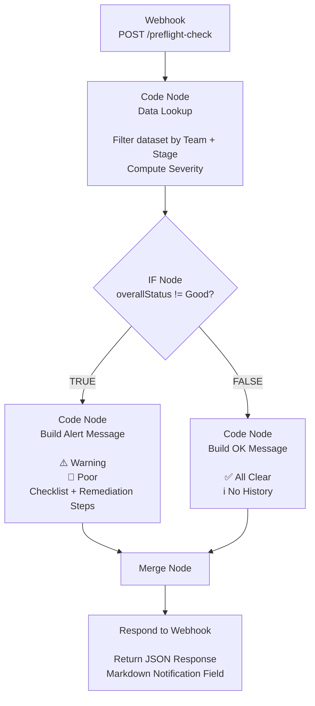

# preflight_workflow
Built as a take-home assignment for the Technical Program Manager (Engineering Operations) role.

# Workflow Architecture

## How to run

1. Install n8n: `npm install -g n8n && n8n start`
2. Import `preflight_workflow.json` via the n8n UI (Import Workflow)
3. Activate the workflow using the toggle
4. Open terminal and run:
   curl -X POST `WebhookURL` -H "Content-Type: application/json" \
  -d '{"team_name": "Gamma Engineers", "current_sdlc_stage": "Integration Testing"}'

## Architecture & Scaling Notes

# CI/CD Pipeline Integration
In a real engineering org, this workflow would be triggered automatically rather than via manual curl. The ideal integration point is a GitHub Actions or GitLab CI job that fires at SDLC stage transitions. For example, when a PR is merged into main (entering Coding → PR Review), when a release branch is cut (entering Ready To Release), o when a Jira ticket moves to a new status via webhook.

# Data Layer
The current prototype embeds a static dataset inside the Code node. At scale, this would be replaced by a live data fetch node pulling from whichever system owns the metrics — Jira (via REST API), a data warehouse (BigQuery, Redshift), or a Grafana datasource.

# Notification Delivery
Today the workflow returns a JSON response. In production, the Respond to Webhook node would be replaced (or supplemented) with a Slack node or MS Teams node that posts the Markdown directly into the team's sprint channel, tagging relevant engineers.
